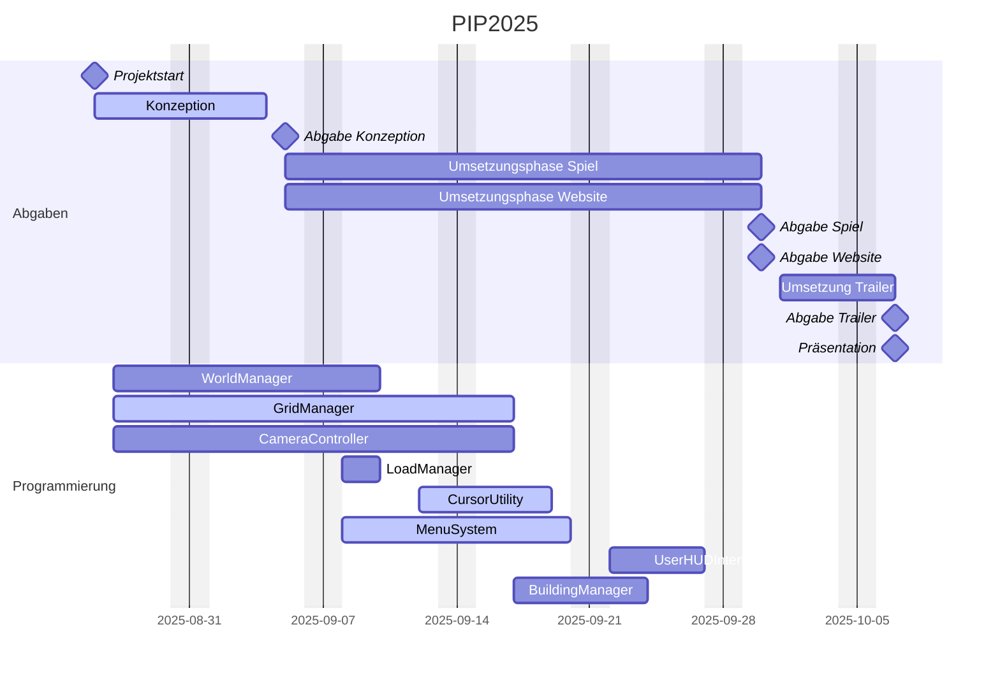

# PIP 2025

```mermaid
gantt
    title PIP2025
    dateFormat  YYYY-MM-DD
    excludes    weekends
%%%%%%%%%%%%%%%%%%
%%   Abgaben    %%
%%%%%%%%%%%%%%%%%%

section Abgaben

Projektstart            : milestone,  m0,   2025-08-26,     0d
Konzeption              : active,     k0,   after m0,       2025-09-04
Abgabe Konzeption       : milestone,  m1,   2025-09-05,     0d
Umsetzungsphase Spiel   :             g1,   2025-09-05,     2025-09-30
Umsetzungsphase Website :             g2,   2025-09-05,     2025-09-30
Abgabe Spiel            : milestone,  m2,   2025-09-30,     0d
Abgabe Website          : milestone,  m3,   2025-09-30,     0d
Umsetzung Trailer       :             g2,   2025-10-01,     2025-10-07 
Abgabe Trailer          : milestone,  m4,   2025-10-07,     0d
Präsentation            : milestone,  m5,   2025-10-07,     0d

%%%%%%%%%%%%%%%%%%%%
%% Programmierung %%
%%%%%%%%%%%%%%%%%%%%
section Programmierung

WorldManager           : worldmanager, 2025-08-27, 2025-09-10
GridManager            : active, gridmanager, 2025-08-27, 15d
CameraController       : cameracontroller, 2025-08-27, 15d
LoadManager            : loadmanager, 2025-09-08, 2025-09-10
CursorUtility          : active, cursorutility, 2025-09-12, 5d
MenuSystem             : active, menusystem, 2025-09-08, 10d
UserHUDInterface       : userhudinterface, after menusystem, 5d
BuildingManager        : buildingmanager, after gridmanager cameracontroller, 5d

```
